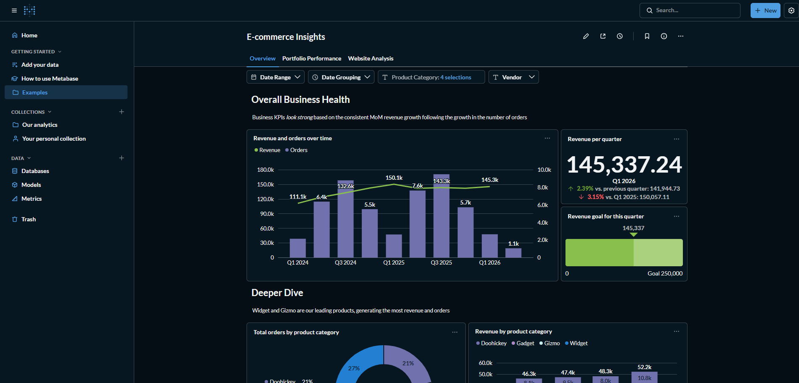
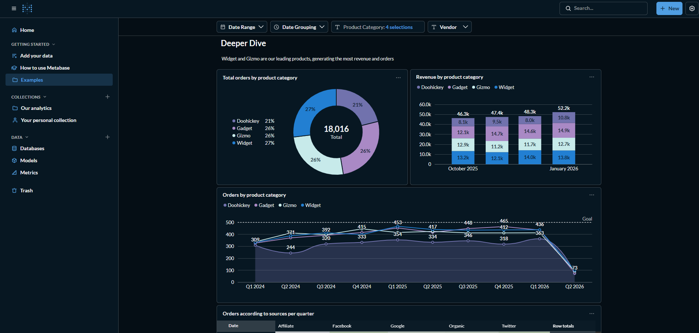
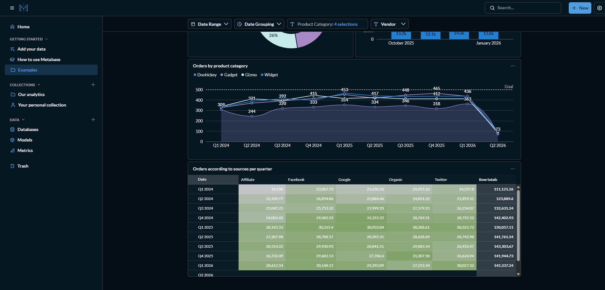

# Semantic Layer & OLAP Project: Visual Guide

## Project Overview

This project demonstrates the core concepts of **OLAP cubes** and **semantic layers** through hands-on implementation using Metabase and e-commerce sample data.

---

## Project Architecture

```
Raw Data (ORDERS, PRODUCTS, CUSTOMERS tables)
    ↓
Data Model (Star Schema with Fact & Dimension tables)
    ↓
Pre-aggregated Cube (hypothetical - demonstrates OLAP concept)
    ↓
Semantic Layer (Metric definitions: Revenue, Order Count, AOV)
    ↓
Business Intelligence Tools (Metabase dashboards)
    ↓
End Users (Analysts, Business Stakeholders)
```

---

## Learning Path with Screenshots

### Phase 1: Understanding Data Structure

**Screenshot 1**: Metrics Definition in Metabase



**What This Shows**:
- Created 3 business metrics in Metabase:
  - **Total Revenue**: SUM(Total) - financial performance indicator
  - **Order Count**: COUNT(Orders) - transaction volume indicator
  - **Average Order Value**: Revenue / Order Count - customer spending behavior
- These metrics form the **semantic layer** - the single source of truth for all analyses
- Ensures every analyst uses the same definitions

**Key Learning**:
> Without a semantic layer, different people define "Revenue" differently, leading to conflicting reports. The semantic layer prevents this confusion.

---

### Phase 2: OLAP Operations in Action

**Screenshot 2**: Multi-dimensional OLAP Query Results



**What This Shows**:
- Querying data across multiple dimensions simultaneously
- Demonstrating OLAP operations:
  - **Roll-up**: Aggregated data by time period (Years/Months)
  - **Drill-down**: Ability to see more detailed levels
  - **Filtering**: Applied across product categories and regions

**OLAP Operations Performed**:
| Operation | Example | Benefit |
|-----------|---------|---------|
| **Roll-up** | Year-level aggregation | See big-picture trends |
| **Drill-down** | Month-level detail | Investigate specific periods |
| **Slice** | Filter by single dimension | Isolate data (e.g., "Gadgets only") |
| **Dice** | Multi-dimensional filter | Complex analysis (e.g., "Gadgets in CA") |

**Key Learning**:
> OLAP enables fast, multidimensional analysis because cubes pre-compute these aggregations instead of scanning raw data each time.

---

### Phase 3: Real-World Dashboard Application

**Screenshot 3**: Business Intelligence Dashboard



**What This Shows**:
- A complete dashboard using the semantic layer metrics
- Multiple visualizations showing:
  - Revenue trends over time (Time dimension)
  - Sales by product category (Product dimension)
  - Geographic distribution (Location dimension)
- All metrics use the officially defined formulas from the semantic layer
- Consistency across all views

**Dashboard Components**:
```
┌─────────────────────────────────────────────────┐
│  E-Commerce Analytics Dashboard                 │
├─────────────────────────────────────────────────┤
│  Total Revenue    Order Count    Avg Order Val  │
│  $920,000         2,547          $361.42       │
├─────────────────────────────────────────────────┤
│  Revenue Trend (Time Dimension)      │ Category │
│  [Line Chart showing monthly revenue] │ by Sales │
├─────────────────────────────────────────────────┤
│  Geographic Heat Map (Location Dim)             │
│  [Map showing revenue by state]                 │
└─────────────────────────────────────────────────┘
```

**Key Learning**:
> The semantic layer ensures this dashboard uses consistent metrics. If someone creates another dashboard, it shows the same "Revenue" because it's defined once.

---

## What You've Learned

### OLAP Concepts ✅
- **Dimensions**: Categorical fields (Time, Product, Location) for slicing data
- **Measures**: Numeric fields (Revenue, Count) for aggregation
- **Hierarchies**: Multi-level dimensions (Year → Month → Day)
- **Pre-aggregation**: Pre-computing all combinations for instant queries
- **OLAP Operations**: Roll-up, drill-down, slice, dice

### Semantic Layer Concepts ✅
- **Single Source of Truth**: One definition for each metric
- **Business Abstraction**: Technical SQL hidden behind business names
- **Data Governance**: Centralized control over metric definitions
- **Consistency**: Everyone uses the same numbers
- **Scalability**: Easy to maintain metrics across large organizations

### Real-World Value ✅
- **Performance**: OLAP cubes make dashboards load in milliseconds
- **Governance**: Prevent metric definition conflicts
- **Scalability**: Works for companies with 1M+ transactions daily
- **Maintainability**: Changes to formulas happen in one place

---

## Technical Stack Used

| Component | Tool | Purpose |
|-----------|------|---------|
| **Data Source** | PostgreSQL Sample DB | Raw transactional data |
| **BI Platform** | Metabase | Visualization & metric definition |
| **Semantic Layer** | Metabase Metrics | Centralized metric definitions |
| **Documentation** | Markdown | Knowledge sharing |
| **Deployment** | Docker | Easy setup and reproducibility |

---

## Real-World Applications

### E-Commerce (This Project)
- Revenue tracking by product, region, time period
- Customer behavior analysis (AOV trends)
- Seasonal performance comparison

### Healthcare
- Patient metrics (admission rates, treatment outcomes)
- Hospital performance benchmarking
- Resource utilization analysis

### Finance
- Transaction metrics (volume, value)
- Risk metrics (fraud detection)
- Portfolio performance tracking

### Manufacturing
- Production metrics (output, quality)
- Equipment performance (uptime, efficiency)
- Supply chain optimization

---

## Performance Comparison

### Without OLAP Cube
- Query: "Revenue by Product Category and State for past 12 months"
- Time: **5-30 seconds** (scans millions of rows)
- Infrastructure: Moderate CPU/RAM usage
- User Experience: Slow dashboard load

### With OLAP Cube
- Query: "Revenue by Product Category and State for past 12 months"
- Time: **0.1-0.5 seconds** (pre-computed lookup)
- Infrastructure: Minimal CPU/RAM (just lookup)
- User Experience: Instant dashboard load

**Why?**
Pre-computed aggregations trade storage space (10x larger) for query speed (100x faster).

---

## Key Metrics Defined (Semantic Layer)

### 1. Total Revenue
```sql
SUM(Orders.Total)
```
**Use**: Revenue forecasting, business performance
**Sliceable by**: Product Category, State, Time, Customer Segment

### 2. Order Count
```sql
COUNT(DISTINCT Orders.ID)
```
**Use**: Volume analysis, market penetration
**Sliceable by**: Product Category, State, Time, Payment Method

### 3. Average Order Value
```sql
Total Revenue / Order Count
```
**Use**: Pricing strategy, customer segmentation
**Sliceable by**: Product Category, State, Time, Customer Segment

---

## How to Extend This Project

### Option 1: Add More Metrics
- **Profit Margin** = (Revenue - Cost) / Revenue
- **Customer Retention Rate** = Returning Customers / Starting Customers
- **Churn Rate** = Lost Customers / Starting Customers

### Option 2: Add More Dimensions
- **Customer Segment**: VIP, Premium, Regular, Discount
- **Payment Method**: Credit Card, PayPal, Bank Transfer
- **Product Brand**: Individual brand names

### Option 3: Build a Real OLAP Cube
- Tools: Apache Kylin, Cube.js, or Apache Druid
- Create actual pre-aggregated multidimensional arrays
- Experience true sub-second query performance on large datasets

### Option 4: Deploy to Production
- Set up Metabase on AWS/Azure/GCP
- Connect to production database
- Build real-world dashboards for the business

---

## Files in This Project

```
Semantic Layer & OLAP/
├── SEMANTIC_LAYER_METRICS.md          # Metric definitions & governance
├── PROJECT_VISUAL_GUIDE.md            # This file
├── README.md                          # Project overview (to be created)
└── screenshots/
    ├── 01-metrics-definition.png      # Semantic layer in Metabase
    ├── 02-revenue-trend-query.png     # OLAP operations
    └── 03-multi-dimensional-filter.png # Real-world dashboard
```

---

## Key Takeaways

1. **OLAP Cubes** = Pre-aggregated data structure for fast queries
2. **Semantic Layer** = Consistent metric definitions for data governance
3. **Together** = Performance + Consistency + Governance
4. **Real-world value** = Dashboard loads instantly, metrics are consistent across org
5. **Scalability** = Same approach works for companies with billions of transactions

---

## Resume Impact

You can now claim:
- ✅ **OLAP expertise**: Dimensions, measures, hierarchies, aggregations
- ✅ **Semantic layer design**: Metric definition, data governance
- ✅ **BI tool proficiency**: Metabase, query building, dashboards
- ✅ **Data modeling**: Star schema, fact/dimension tables
- ✅ **Real-world project**: Complete end-to-end implementation

---

## References & Further Learning

### Tools Explored
- **Metabase**: Free, open-source BI tool (https://www.metabase.com)
- **Docker**: Containerization for easy setup

### Related Technologies
- **Apache Kylin**: Enterprise OLAP engine
- **Cube.js**: Modern semantic layer + OLAP
- **dbt**: Data transformation with semantic layer
- **Power BI / Looker**: Enterprise BI platforms

### Concepts to Deepen
- MDX (Multidimensional Expressions language for OLAP)
- Data warehouse architecture (Star schema, Snowflake schema)
- Query optimization with indexing
- Real-time vs. batch aggregation

---

**Project Status**: ✅ COMPLETE

**Next Steps**: Portfolio presentation, GitHub upload, resume update

